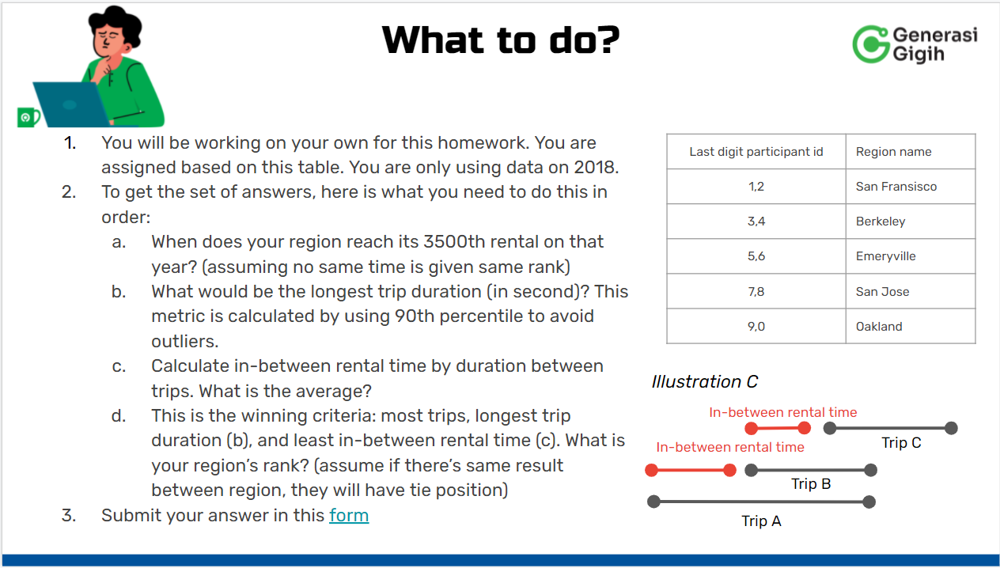

<div class="m-3" id="problem">
    <br />
    <h2>🧠 Study Case:</h2>
</div>

<div align="center">
  
</div>

<div align="center">
  
</div>

<div class="m-3" id="data">
    <br />
    <h2>🎯 Solution:</h2>
</div>

```SQL
--solution a
WITH berkeley_station as (
    SELECT a.name as region_name,b.station_id, b.name as station_name, b.region_id
    FROM `bigquery-public-data.san_francisco_bikeshare.bikeshare_regions` as a
    INNER JOIN `bigquery-public-data.san_francisco_bikeshare.bikeshare_station_info` as b
    ON a.region_id = b.region_id
    WHERE b.region_id = (
        SELECT a.region_id
        FROM `bigquery-public-data.san_francisco_bikeshare.bikeshare_regions` as a
        WHERE a.name = 'Berkeley'
    )
),
berkeley_trips as (
    SELECT
    ROW_NUMBER() OVER (ORDER BY t.start_date ASC) AS no_trips,
        Berkeley_station.region_id, Berkeley_station.region_name,
        CAST(t.duration_sec as FLOAT64) as duration_sec, t.start_date, t.start_station_name,
        t.start_station_id, t.end_date, t.end_station_name, t.end_station_id
    FROM `bigquery-public-data.san_francisco_bikeshare.bikeshare_trips` as t
    INNER JOIN Berkeley_station
    ON t.start_station_name = Berkeley_station.station_name
    WHERE EXTRACT(YEAR FROM t.start_date) = 2018
    ORDER BY duration_sec ASC
)

SELECT *
FROM berkeley_trips
WHERE no_trips = 3500;
```

Find out the dataset [here.](https://drive.google.com/file/d/1YDQ9cGBNSu-pYAY5E9CQMHmskiuqa9E-/view?usp=sharing)
